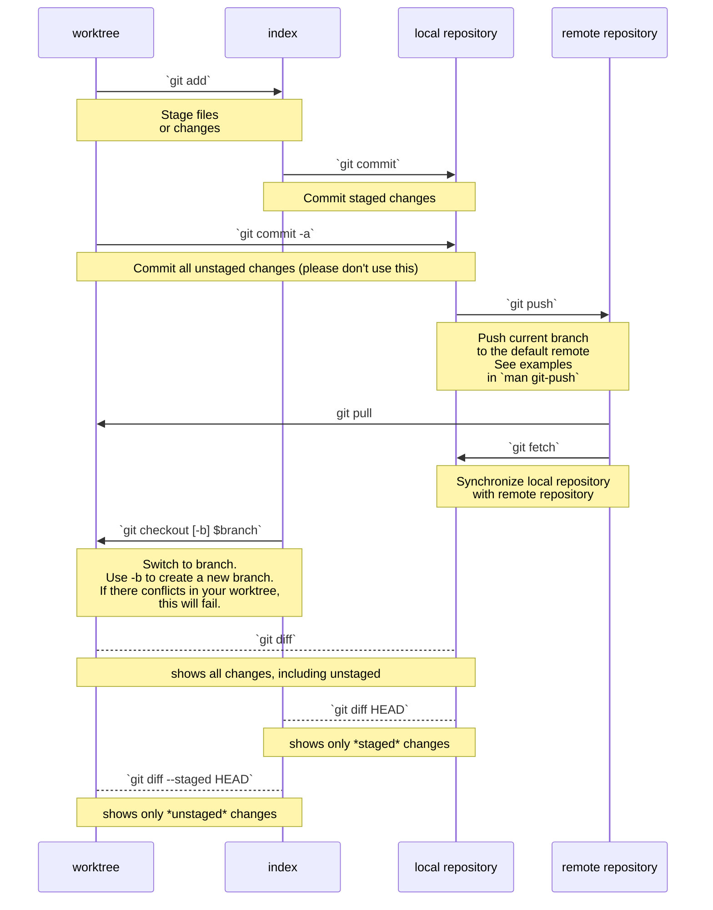

# Git Commands

+ TODO: `git difftool`
+ TODO: describe more problems/solutions
+ TODO: describe more sourcetree features
+ TODO: quick example for `diffoscope`?

## Docs

+ Sourcetree: [Download](http://sourcetreeapp.com/) and [Knowledge Base](https://confluence.atlassian.com/sourcetreekb/sourcetree-basics-780870007.html)
+ Github Desktop: [Download](https://desktop.github.com/download/) and [Docs](https://docs.github.com/en/desktop)

## Overview

+ Introduce some `git` concepts. Describe how to solve specific problems with the features of [Github Desktop](https://docs.github.com/en/desktop) and [Sourcetree](http://sourcetreeapp.com/)
+ Introduce plain `diff` with an example. This helps to determine what's in an FRC template -- e.g. to compare different versions of the 2026 AdvantageScope templates.

### Diagram

This diagram illustrates the basic `git` commands.




# Git GUI

Having a GUI tool is essential for new users. This visually introduces you to some of the concepts in `git` without needing to understand the command-line semantics.


|                                                        | Windows | MacOS | Linux |
| -----------------------------------------------------: | :------ | :---- | :---- |
|               [Source Tree](http://sourcetreeapp.com/) | ✔      | ✔    |       |
| [Github Desktop](https://desktop.github.com/download/) | ✔      |       |       |

## Github Desktop

- [Make Changes in a branch](https://docs.github.com/en/desktop/making-changes-in-a-branch/committing-and-reviewing-changes-to-your-project-in-github-desktop). This helps new users to understand what a commit or diff is. Using this in VS Code feels a bit cramped.
- [Managing Commits](https://docs.github.com/en/desktop/managing-commits/options-for-managing-commits-in-github-desktop) and [Squashing Commits](https://docs.github.com/en/desktop/managing-commits/squashing-commits-in-github-desktop). You probably won't be squashing, but the main thing here is that new users need to be able to visually explore Git's functions

## Sourcetree

- Sourcetree can [open terminals](https://support.atlassian.com/sourcetree/kb/using-terminal-in-sourcetree/). Windows users may want to set `Use Git Bash as default terminal`. See the link for more info.
- [Stashing changes to files](https://support.atlassian.com/sourcetree/kb/stash-a-file-with-sourcetree/)

## Common Problems & Solutions

### Not Seeing Remote Changes

**Run `git fetch` to sync with the remote repository's branches**: `git fetch` this will update the local repository to include references to remote branches. This only makes `git` aware of changes on Github, whereas `git pull` will attempt download updates.

### What changed in that other branch?

**Diff a range of commits:** this is essential for quickly understanding the total changes introduced by a branch. The other simple way to do so is to wait for a PR. For Sourcetree, simply `Shift+Click` or `Ctrl+Click` the commits you want to focus on.

When viewing the changes in another branch, *focus first on the set of files changed*. This helps you get a feel for whether `git pull` (rebase), `git merge`, `git stash pop` or `git checkout` would succeed.

### Suddenly, VSCode shows a ton of red in the "Problems" tab

In VSCode, press `Ctrl+Shift+M` to quickly accessing the `Problems` tab, which shows all the Java errors or warnings for your project. Using the problems tab helps you narrow down errors one by one. Usually there are one or two errors that cause many others.

+ If your `java` files have merge conflicts, this will prevent that `java` code from being parsed correctly.
+ The next thing to try: `Ctrl+Shift+P` then `WPILib run Gradle clean`
+ Sometimes, large changes can affect VSCode's processing of Java. This happens when cache files become dirty. Hit `Ctrl+Shift+P` and `Java: Clean Language Server Workspace`. This will also run `Java: Restart Java Language Server`.

If you try running the project when VSCode detects cache problems, a box pops up in the lower-right corner offering to fix the problems.

### I need to review another branch, but I can't commit right now

If you're new at git, it's much easier to maintain a second *clean* `git clone` for reviewing changes. You'll need to run `git fetch` or `git pull` in each to get updates.

+ Use your primary clone to work on newer, long-running features. For us, use this clone to make all changes.
+ And a secondary reference-only clone for reviewing changes. Don't make changes here.

> You can avoid needing a second clone if you review changes online using Github's web application. Having the changes locally helps you run code or use faster editor features. It's absolutely not required.
>
> It's perfectly acceptable to have multiple clones. Note that this can get messy, especially if you're actively working on multiple clones.

You may also use `git stash` to do this. That's not a command for beginners. See the section on `git-stash` below.

# Git Config

## `~/.gitconfig`

Git has a few different configuration locations where it *"merges"* options. Thus, you can have global configuration and then project-specific configurations. Below, the order in which these configurations are applied

- The system config, `$(prefix)/etc/gitconfig`, usually at `/etc/gitconfig`.
- The user's `$XDG_CONFIG_HOME/git/config` or, if that doesn't exist, `~/.gitconfig`. This file will exist somewhere else for Windows users. Thus, you may prefer using `git config --global` instead.
- `$GIT_DIR/config`

> `$GIT_DIR` refers to the `$MYPROJECT/.git` which contains the repository's local files.

A project's configuration, found at `$GIT_DIR/.git/config` will be set to some default values after you `git clone` a repository. And thus, you need to set them for each new clone.

### User Config

This section configures `git` to include

```gitconfig
[user]
  email = myemailforgithub@example.com
  name = Myname Ingitcommits

[github]
  user = dcunited001

# This section sets `autocrlf` to convert Window's `\r\n` line endings to `\n`
[core]
  autocrlf = input
```

### Configure `pull` and `rebase`

With [pull.rebase](https://git-scm.com/docs/git-config#Documentation/git-config.txt-pullrebase), `git pull` will rebase instead of merge, making remote changes easier to deal with. See the diagram at the top.

```gitconfig
[pull]
  rebase = true
```

With `rerere.enabled`, rebasing and pulling will remember merge conflict resolution, making them less likely to occur again. (TODO: explain further?)

```gitconfig
# https://git-scm.com/docs/git-config#Documentation/git-config.txt-rerereenabled
[rerere]
  enabled = true
```

With `rebase.autoStash`, you can pull without clearing out your index & worktree. (NOTE: explain further?)

```
# https://git-scm.com/docs/git-config#Documentation/git-config.txt-rebaseautoStash
[rebase]
  autoStash = true
```

# Diffs

## Git Diffs

#### `git difftool`

Having an extra app or tool for pure diffs can be handy.

### Pure Diffs

These commands will allow you to diff file trees that are outside of a `git` repository.

|                                                          | Windows | MacOS | Linux | CLI |
| -------------------------------------------------------: | :------ | :---- | :---- | :-- |
| [GNU Diffutils](https://www.gnu.org/software/diffutils/) | ✔      | ✔    | ✔    | :v: |
|                 [KDiff](https://kdiff3.sourceforge.net/) | ✔      | ✔    | ✔    |     |
|                           [Meld](https://meldmerge.org/) | ✔      | ✔    | ✔    |     |

Using `meld` is recommended. Trying out `diff` from DiffUtils is suggested as an advanced exercise.

### Why `git init` Before Changing The Template's Code?

# Advanced

## Advanced `diff`

#### Diffutils

This is one of the most important pieces of software to ever exist, though it can be a bit more advanced to use. You'll need it to contribute to Linux, which still uses an email-based workflow

+ For packages: see [repology](https://repology.org/project/diffutils/versions) or [WinGet](https://winstall.app/apps/GnuWin32.DiffUtils) (for Windows)
+ [HTML Manual](https://www.gnu.org/software/diffutils/manual/diffutils.html)
+ [PDF Manual](https://www.gnu.org/software/diffutils/manual/diffutils.pdf)

### File-System Diffs

Find differences & changed files in a file system.

|                                              | Windows | MacOS | Linux | CLI |
| -------------------------------------------: | :------ | :---- | :---- | :-- |
|        [Diffoscope](https://diffoscope.org/) |         | ✔    | ✔    | :v: |
| [Czkawka](https://github.com/qarmin/czkawka) | ✔      | ✔    | ✔    |     |

#### Diffoscope

This is a fairly advanced tool that answers questions like:

+ We loaded this version of Photonvision onto our OrangePi. Which files changed?
+ How did specific types of files change? Zip file? Executable file? It uses other CLI tools to generate text-based output that it compares.

This diff tool is file-type aware. It uses other tools to dig into specific types of files, like archives or executables and shows you things like: both images (or zip-files) contain this executable file, but which libaries does each link to?

#### Czkawka

Krokiet is the GUI frontend for Czkawka. This tool is especially useful if you need to compare against backups that aren't stored in the cloud. If for some reason, you need a tool like Czkawka/Krokiet and you're not using it, this could save hundreds or thousands of hours of your time. If you primarily back your files up to cloud storage, that's not so

## Advanced `git`

### `git stash`

#### To save current changes without committing them

1) Open your GUI tool and review your changes. Try to anticipate whether you'll encounter a merge conflict. Just guess until you get a feel for it.
2) Run `git stash`. It is possible to stash only the staged changes or the unstaged changes, but that's fairly advanced.
3) Run whatever `git pull` or `git checkout` commands you need.
4) When you're on the branch you want to update with your stashed changes, run `git stash pop`.
5) Open the GUI tool again and check for a merge conflict.

Running `git stash pop` without arguments will always "pop" the last stash.

+ In CS lingo, `git-stash` uses a **stack** which is **LIFO**: *last-in, first-out*
+ The complementary concept is a **queue** which is **FIFO**: *first-in, first-out*.

`git stash` is *not* considered a command for beginners for various reasons:

- It's easy for a `stash` to get lost, since the stash exists in `$GIT_DIR/.git`
- When using `git stash` frequently, it's messy to have popped the wrong stash
- When you `git stash pop` it can lead to merge conflicts.

### `git config`

#### Configure `branch`

> This turned out to be redundant & confusing.

These commands change how `git` will **track** new branches that you create. If your branch is "tracking" a remote branch, then `git pull` will attempt to *merge* or *rebase* changes from upstream.

```gitconfig
[branch]
  autoSetupMerge = true    # true is the default!
  autoSetupRebase = remote # redundant when pull.rebase=true
```

+ By default, [branch.autoSetupMerge](https://git-scm.com/docs/git-config#Documentation/git-config.txt-branchautoSetupMerge) is set to `true`. Configuring it is redundant.
+ By default, [branch.autoSetupRebase](https://git-scm.com/docs/git-config#Documentation/git-config.txt-branchautoSetupRebase) is set to never. However, `pull.rebase` will override this when it's set in a branch's configuration.

When `branch.autoSetupMerge=true`, commands like `git switch -c $newbranch` and `git checkout -b newbranch` will run as though you included `--track origin/newbranch`.

Some commands will automatically create branch configuration in the project's `.git/config`. It's useful to verify the content in this file if you're unsure.

```gitconfig
# branch.autoSetupMerge would create these three lines here
[branch "UpdateModalManager"]
  remote = origin
  merge = refs/heads/UpdateModalManager

  # branch.autoSetupRebase will create this line.
  rebase = true # If pull.rebase=true, `git pull` would rebase anyways
```

If git is not aware of a remote branch named `origin/newbranch`, then `branch.autoSetupMerge` does nothing.

```bash
git switch -c new-feature

# this would fail if the remote branch doesn't exist
git switch -c new-feature-2 --track origin/remote-branch-doesnt-exist
```

#### Editor Config

`core.editor` sets the default editor that `git` will open for some advanced commands.

+ By default, `git` will use what's set in the environment variable `$GIT_EDITOR`.
+ It's simplest that this opens & completes in the terminal.
+ Unless otherwise specified, MacOS and Linux systems will open `$EDITOR` or `$VISUAL`.

```gitconfig
[core]
  editor = code --wait
```

`core.editor` tells `git` which editor to open for some commands, like `git rebase --interactive`. You may also set it as below if you use `nvim`. Leave this blank if you do not plan to use it.

```gitconfig
[core]
  editor = nvim
```

Typically, when CLI tools open editors, it's also important that (1) you can *trust* the editor that opens (2) the memory contents of the editing session are cleared after the editing session completes. For that reason and others, tools like `systemctl` will describe a separate `$SYSTEMD_EDITOR` -- many editors will save information on-disk to cache files. If concerned about that, use `vim`, `vi`, `nano`, listed in order of increasing trustworthiness.

#### Hooks

For advanced users interested in "Bash" scripting: **all** git repositories are distributed with a standard set of `git-hook` examples. Run `man githook` for more information.

Eventually, you'll want to understand these hooks. Every few years, you should come back and try to understand them, until something clicks. Since it's difficult to push fixes to these scripts, they are good examples of bash scripting for automation.

To use a hook, you'd remove the suffix from one of the `.git/hooks/*.sample` files, perhaps customizing it. Before Github Actions, your project may distribute & set up a `git hook` to enforce policy for:

- `commit-msg` format
- confirmation that code formatting tools had run with `pre-commit`

##### Git Log Example

> This is definitely TMI, but hopefully it's useful to someone later. The script here isn't a great example, but the `git diff` and `git log` commands allow you to "ask" the repository questions.

Consider the "stakes" of distributing software:

+ How costly is a mistake?
+ How does a mistake affect users?

While these are examples, they must run on all systems they are distributed to. They may differ for Linux, Mac OS or BSD. Since these scripts set expectations for norms surrounding `git-hook` usage, they should be exceptionally clean.

Controlling `git`'s output format for `git log` commands is difficult, but important, even since the adoption of GUI tooling and CI Tooling like GH Actions. It's difficult and this is one reason the first line of a commit should be short. You may break scripts and tooling which you're not fully aware of.

```bash
t=$(mktemp -d) # make a temp directory

# clone git's source code into it
git clone https://gitlab.com/git-scm/git.git $t/git
cd $t/git

# the glob expands into the array, but depends on the files being present
newpaths=(templates/hooks/*.sample)

# the hooks were moved about a year ago. defining these as variables allows the
# `git log` commands below to seem more clear and less intimidating.

# The (foo-{bar,baz}.sample) syntax expands into the full list
oldpaths=(templates/hooks--{applypatch-msg,\
commit-msg,\
fsmonitor-watchman,\
post-update,\
pre-applypatch,\
pre-commit,\
pre-merge-commit,\
pre-push,\
pre-rebase,\
pre-receive,\
prepare-commit-msg,\
push-to-checkout,\
sendemail-validate,\
update}.sample)

# count the commits: these files have been included in at least 64 commits
git log --pretty=reference -- ${newpaths[@]} ${oldpaths[@]} | wc -l

# show the git log
git log --pretty=reference -- ${newpaths[@]} ${oldpaths[@]}
```
