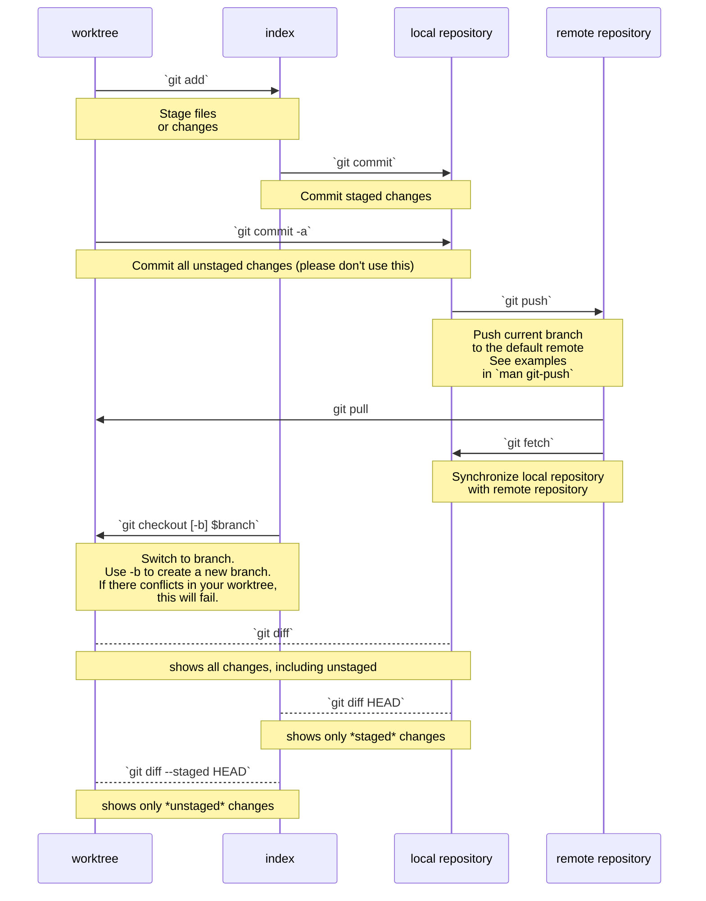

# Git Commands

+ TODO: `git difftool`
+ TODO: describe more problems/solutions
+ TODO: describe more sourcetree features
+ TODO: quick example for `diffoscope`?

## Docs

+ Sourcetree: [Download](http://sourcetreeapp.com/) and [Knowledge Base](https://confluence.atlassian.com/sourcetreekb/sourcetree-basics-780870007.html)
+ Github Desktop: [Download](https://desktop.github.com/download/) and [Docs](https://docs.github.com/en/desktop)

## Overview

+ Introduce some `git` concepts. Describe how to solve specific problems with the features of [Github Desktop](https://docs.github.com/en/desktop) and [Sourcetree](http://sourcetreeapp.com/)
+ Introduce plain `diff` with an example. This helps to determine what's in an FRC template -- e.g. to compare different versions of the 2026 AdvantageScope templates.

### Diagram

This diagram illustrates the basic `git` commands.

# Git GUI

Having a GUI tool is essential for new users. This visually introduces you to some of the concepts in `git` without needing to understand the command-line semantics.

|                                                        | Windows | MacOS | Linux |
| -----------------------------------------------------: | :------ | :---- | :---- |
|               [Source Tree](http://sourcetreeapp.com/) | ✔      | ✔    |       |
| [Github Desktop](https://desktop.github.com/download/) | ✔      |       |       |

## Github Desktop

Again, run through the tutorial if you're new to `git`

- [Make Changes in a branch](https://docs.github.com/en/desktop/making-changes-in-a-branch/committing-and-reviewing-changes-to-your-project-in-github-desktop). This helps new users to understand what a commit or diff is. Using this in VS Code feels a bit cramped.
- [Managing Commits](https://docs.github.com/en/desktop/managing-commits/options-for-managing-commits-in-github-desktop) and [Squashing Commits](https://docs.github.com/en/desktop/managing-commits/squashing-commits-in-github-desktop). You probably won't be squashing, but the main thing here is that new users need to be able to visually explore Git's functions

### Configuration

#### `Authentication` Tab

Account setup can also be configured here if using `git-credential-manager`. Otherwise, set up your login using the `Accounts` tab.

#### `Integrations` Tab

+ Set the editor to `C:\Users\Public\wpilib\2026\vscode\Code.exe` if installed for all users. Otherwise, choose an editor `.exe` or set it to your user's installation of WPILib VSCode.
+ Consider changing `Shell` to `Git Bash`. For other applications,configuring this would integrate more cleanly with scripts, but Github Desktop is designed to work with several types of Windows shell environments.

#### `Prompts` Tab

The list of confirmation dialogs here describes potentially "dangerous" Git operations that could cause you or someone else to lose work. Most of these are fine.

> Advanced: "Force Pushing" should be generally avoided. Almost always, it
> should be done "with lease."

## Sourcetree

- Sourcetree can [open terminals](https://support.atlassian.com/sourcetree/kb/using-terminal-in-sourcetree/). Windows users may want to set `Use Git Bash as default terminal`. See the link for more info.
- [Stashing changes to files](https://support.atlassian.com/sourcetree/kb/stash-a-file-with-sourcetree/)

## Common Problems & Solutions

### Not Seeing Remote Changes

**Run `git fetch` to sync with the remote repository's branches**: `git fetch` this will update the local repository to include references to remote branches. This only makes `git` aware of changes on Github, whereas `git pull` will attempt download updates.

### What changed in that other branch?

**Diff a range of commits:** this is essential for quickly understanding the total changes introduced by a branch. The other simple way to do so is to wait for a PR. For Sourcetree, simply `Shift+Click` or `Ctrl+Click` the commits you want to focus on.

When viewing the changes in another branch, *focus first on the set of files changed*. This helps you get a feel for whether `git pull` (rebase), `git merge`, `git stash pop` or `git checkout` would succeed.

### Suddenly, VSCode shows a ton of red in the "Problems" tab

In VSCode, press `Ctrl+Shift+M` to quickly accessing the `Problems` tab, which shows all the Java errors or warnings for your project. Using the problems tab helps you narrow down errors one by one. Usually there are one or two errors that cause many others.

+ If your `java` files have merge conflicts, this will prevent that `java` code from being parsed correctly.
+ The next thing to try: `Ctrl+Shift+P` then `WPILib run Gradle clean`
+ Sometimes, large changes can affect VSCode's processing of Java. This happens when cache files become dirty. Hit `Ctrl+Shift+P` and `Java: Clean Language Server Workspace`. This will also run `Java: Restart Java Language Server`.

If you try running the project when VSCode detects cache problems, a box pops up in the lower-right corner offering to fix the problems.

### I need to review another branch, but I can't commit right now

If you're new at git, it's much easier to maintain a second *clean* `git clone` for reviewing changes. You'll need to run `git fetch` or `git pull` in each to get updates.

+ Use your primary clone to work on newer, long-running features. For us, use this clone to make all changes.
+ And a secondary reference-only clone for reviewing changes. Don't make changes here.

> You can avoid needing a second clone if you review changes online using Github's web application. Having the changes locally helps you run code or use faster editor features. It's absolutely not required.
>
> It's perfectly acceptable to have multiple clones. Note that this can get messy, especially if you're actively working on multiple clones.

You may also use `git stash` to do this. That's not a command for beginners. See the section on `git-stash` below.
