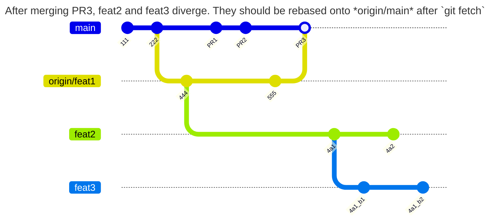

> NOTE these notes are early, but these diagrams may be helpful. They are generated using [Git Graph](https://mermaid.ai/open-source/syntax/gitgraph.html)

## Collaboration

### Push

#### Force Pushing

"Force Pushing" should be generally avoided. Almost always, it should be done "with lease."

> "With lease" means that the remote ref is only updated if no updates had been pushed by anyone else yet -- or possibly pushed by the developer themselves. Without the lease, then it's fairly simple to overwrite commits pushed by someone else.

It sometimes necessary after rebasing a branch that already has a remote `ref`. *This could be messy* with:

+ uncommitted work: `git pull` will refuse to rebase unless unless pushed their commits. If you have `rebase.autosquash` configured, there's a chance it results in a merge conflict: it runs `git stash`, then pulls, then runs `git stash pop`.
+ unpushed commits: in this case, `git pull` will attempt to rebase these or refuse to pull. There's a chance the rebase gets stuck, in which case `git rebase

Clicking the `Update Branch` button in Github will trigger similar ops behind the scene.

In practice, merge conflicts happen frequently, but branches usually belong to the developer. Whether remote refs are updated in this way depends on the style of collaboration and proximity between developers. When collaborating on open source software with devs across the world, this doesn't happen often. If one party intends for the branch to eventually be merged, then having the additional PRs open can create fatigue on maintainers or collaborators -- this is moreso experienced by the dev who hasn't rebased locally or finalized their changes. It may be more frequent in a professional setting.

# Advanced Git
