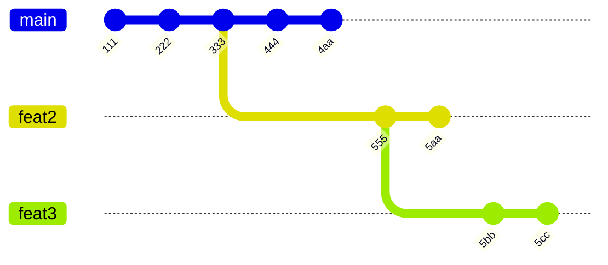
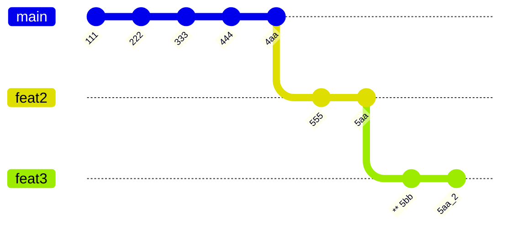
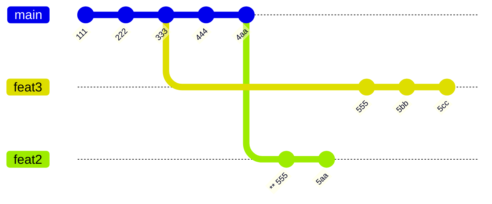

> NOTE these notes are early. Learning to write the Mermaid diagrams below may be helpful. They are generated using [Git Graph](https://mermaid.ai/open-source/syntax/gitgraph.html)

# Advanced `git`

## `git stash`

#### To save current changes without committing them

1) Open your GUI tool and review your changes. Try to anticipate whether you'll encounter a merge conflict. Just guess until you get a feel for it.
2) Run `git stash`. It is possible to stash only the staged changes or the unstaged changes, but that's fairly advanced.
3) Run whatever `git pull` or `git checkout` commands you need.
4) When you're on the branch you want to update with your stashed changes, run `git stash pop`.
5) Open the GUI tool again and check for a merge conflict.

Running `git stash pop` without arguments will always "pop" the last stash.

+ In CS lingo, `git-stash` uses a **stack** which is **LIFO**: *last-in, first-out*
+ The complementary concept is a **queue** which is **FIFO**: *first-in, first-out*.

`git stash` is *not* considered a command for beginners for various reasons:

- It's easy for a `stash` to get lost, since the stash exists in `$GIT_DIR/.git`
- When using `git stash` frequently, it's messy to have popped the wrong stash
- When you `git stash pop` it can lead to merge conflicts.

## `git config`

### Configure `branch`

> This turned out to be redundant & confusing.

These commands change how `git` will **track** new branches that you create. If your branch is "tracking" a remote branch, then `git pull` will attempt to *merge* or *rebase* changes from upstream.

```gitconfig
[branch]
  autoSetupMerge = true    # true is the default!
  autoSetupRebase = remote # redundant when pull.rebase=true
```

+ By default, [branch.autoSetupMerge](https://git-scm.com/docs/git-config#Documentation/git-config.txt-branchautoSetupMerge) is set to `true`. Configuring it is redundant.
+ By default, [branch.autoSetupRebase](https://git-scm.com/docs/git-config#Documentation/git-config.txt-branchautoSetupRebase) is set to never. However, `pull.rebase` will override this when it's set in a branch's configuration.

When `branch.autoSetupMerge=true`, commands like `git switch -c $newbranch` and `git checkout -b newbranch` will run as though you included `--track origin/newbranch`.

Some commands will automatically create branch configuration in the project's `.git/config`. It's useful to verify the content in this file if you're unsure.

```gitconfig
# branch.autoSetupMerge would create these three lines here
[branch "UpdateModalManager"]
  remote = origin
  merge = refs/heads/UpdateModalManager

  # branch.autoSetupRebase will create this line.
  rebase = true # If pull.rebase=true, `git pull` would rebase anyways
```

If git is not aware of a remote branch named `origin/newbranch`, then `branch.autoSetupMerge` does nothing.

```bash
git switch -c new-feature

# this would fail if the remote branch doesn't exist
git switch -c new-feature-2 --track origin/remote-branch-doesnt-exist
```

### Editor Config

`core.editor` sets the default editor that `git` will open for some advanced commands.

+ By default, `git` will use what's set in the environment variable `$GIT_EDITOR`.
+ It's simplest that this opens & completes in the terminal.
+ Unless otherwise specified, MacOS and Linux systems will open `$EDITOR` or `$VISUAL`.

```gitconfig
[core]
  editor = code --wait
```

`core.editor` tells `git` which editor to open for some commands, like `git rebase --interactive`. You may also set it as below if you use `nvim`. Leave this blank if you do not plan to use it.

```gitconfig
[core]
  editor = nvim
```

Typically, when CLI tools open editors, it's also important that (1) you can *trust* the editor that opens (2) the memory contents of the editing session are cleared after the editing session completes. For that reason and others, tools like `systemctl` will describe a separate `$SYSTEMD_EDITOR` -- many editors will save information on-disk to cache files. If concerned about that, use `vim`, `vi`, `nano`, listed in order of increasing trustworthiness.


## Rebase

As long as the `~/.git/config` is set up as described for our team, then much of this git wizardry will already happen behind the scenes with less potential for problems.

> TODO: extract explanation of `git rebase --onto $bash $from $to` from omarchy issue

### A Visual Metaphor

"Rebasing" can be visualized as taking the `tip` of a `branch` -- as in, part of a literal tree branch, visually:

+ where this `tip` itself that gets moved has no other branching segments
+ and is then "pasted" or "grafted" onto another branch.
+ if the length of that `tip` overlapped with other subbranches, those still remain.

That analogy only holds visually, since technically it's more complicated.

### Getting Branches Lined Up...

Given the two feature branches below, the goal is to make the tree as simple as possible.

Below, that goal is clarified for this common case:

+ Reduce the tree down to two `L`-shaped branching points
+ Where there are no sub-branches that "split" outwards.

This is a simpler case of `git rebase` to focus on. You'd encounter it once working on multiple local branches simultaneously. Whether your `feat2` and `feat3` share commits (or not) results in mostly similar `git` commands.

Depending on the order in which either `feat2` or `feat3` are "grafted" `--onto dev`, a few things may happen before the process is complete. This requires a minimum of two `git rebase` invocations, but many GUI tools handle some of this for you.



### Easier To Rebase `feat3` Onto `feat2` First

Depending on the situation, it may be easier to:

+ Find the further tips of branches that need to be updated
+ Then rebase them onto a common branch first -- here the tip of `feat2`.
+ Then move that common `feat1` branch onto the `main` branch.

```shell
git rebase --onto dev "555" feat3...
```



### When `feat2` Gets Rebased First

This is faster, but messier. Commits in `feat2` with `**` prepended to them are recognized as distinct from the "same" commits in `feat3` -- here, git doesn't consider the `555` in `feat3` as exactly identical to `**555` in from `feat2`. This happens for at least two reasons:

1) Depending on how `git` rebased `feat2` onto `main`, then each commit's `diff` content may have changed.
2) The series of commits in `git` function like a blockchain.

```shell
git rebase --onto dev dev feat2...
```



## Hooks

For advanced users interested in "Bash" scripting: **all** git repositories are distributed with a standard set of `git-hook` examples. Run `man githook` for more information.

Eventually, you'll want to understand these hooks. Every few years, you should come back and try to understand them, until something clicks. Since it's difficult to push fixes to these scripts, they are good examples of bash scripting for automation.

To use a hook, you'd remove the suffix from one of the `.git/hooks/*.sample` files, perhaps customizing it. Before Github Actions, your project may distribute & set up a `git hook` to enforce policy for:

- `commit-msg` format
- confirmation that code formatting tools had run with `pre-commit`

## `git log`

### Example

> This is definitely TMI, but hopefully it's useful to someone later. The script here isn't a great example, but the `git diff` and `git log` commands allow you to "ask" the repository questions.

Consider the "stakes" of distributing software:

+ How costly is a mistake?
+ How does a mistake affect users?

While these are examples, they must run on all systems they are distributed to. They may differ for Linux, Mac OS or BSD. Since these scripts set expectations for norms surrounding `git-hook` usage, they should be exceptionally clean.

Controlling `git`'s output format for `git log` commands is difficult, but important, even since the adoption of GUI tooling and CI Tooling like GH Actions. It's difficult and this is one reason the first line of a commit should be short. You may break scripts and tooling which you're not fully aware of.

```bash
t=$(mktemp -d) # make a temp directory

# clone git's source code into it
git clone https://gitlab.com/git-scm/git.git $t/git
cd $t/git

# the glob expands into the array, but depends on the files being present
newpaths=(templates/hooks/*.sample)

# the hooks were moved about a year ago. defining these as variables allows the
# `git log` commands below to seem more clear and less intimidating.

# The (foo-{bar,baz}.sample) syntax expands into the full list
oldpaths=(templates/hooks--{applypatch-msg,\
commit-msg,\
fsmonitor-watchman,\
post-update,\
pre-applypatch,\
pre-commit,\
pre-merge-commit,\
pre-push,\
pre-rebase,\
pre-receive,\
prepare-commit-msg,\
push-to-checkout,\
sendemail-validate,\
update}.sample)

# count the commits: these files have been included in at least 64 commits
git log --pretty=reference -- ${newpaths[@]} ${oldpaths[@]} | wc -l

# show the git log
git log --pretty=reference -- ${newpaths[@]} ${oldpaths[@]}
```
