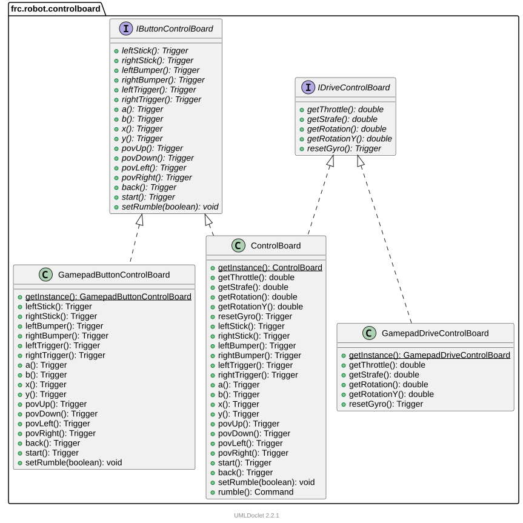

# Create a ControlBoard using Interface Composition

[PR 06](https://github.com/Star-City-Robotics/xrp-scarob/pull/6)

## Resources

+ [com.team254.frc2025.controlboard](https://github.com/Team254/FRC-2025-Public/tree/ae1aa582b1cadb8462e6cb90718880d11a8f42b1/src/main/java/com/team254/frc2025/controlboard)

## The `ControlBoard`

See the controller button mappings below

### Using Team 254's `ControlBoard` interfaces

Team 254's `ControlBoard` pattern uses "interface composition" to allow the top-level implementation of `ControlBoard` to delegate to composed objects. A `ControlBoard` instance implements methods for:

+ `IDriveControlBoard`, a set of `Trigger`'s for the driver's controller.
+ And `IButtonControlBoard`, a set of `Trigger`'s for the operator's controller.
+ In this way, their `ControlBoard` can substitute components for driver/operator roles (or other roles).

### ControlBoard Interface Composition

### `CustomControlBoard` with different underlying implementations

One could create a `CustomControlBoard` implementing both interfaces

- So that the driver uses `DriveJoystickControlBoard extends IDriveControlBoard`
- And the operator uses `OperatorCustomControlBoard extends IButtonControlBoard` with physical arcade buttons.

If these are composed onto the same `CustomControlBoard` interface, then most of the application's logic would not change.

### Implementing `IDriveControlBoard` and `IButtonControlBoard` Separately

If the `RobotContainer` logic was changed (quite a bit), one could wire separate triggers with two different objects:

+ `DriverJoystickControlBoard extends IDriveControlBoard` for the driver
+ `JustOperatorControlBoard extends IButtonControlBoard` for the operator

This seems like a trivial change it is for the implementation internals of the controlboard, but it is *not* for the application that integrates these objects/classes. An explanation of why would be clarified after examining a more mature project that is utilizing the `ControlBoard`

## Team 254's `XboxController` and `Trigger` Mappings

### Driver Mappings

| Xbox Controller   | Method         | Purpose                          |
|:------------------|:---------------|:---------------------------------|
| getLeftX()        | getThrottle()  | speed of forward/backward motion |
| getLeftY()        | getStrafe()    | strafe                           |
| getRightX()       | getRotation()  | rotate X                         |
| getRightY()       | getRotationY() | rotate Y                         |
| start() && back() | resetGyro()    |                                  |

### Operator Mappings

| Xbox Controller    | Method                                                | Purpose                   |
|:-------------------|:------------------------------------------------------|:--------------------------|
| leftTrigger()      | intake()                                              |                           |
| leftBumper()       | autoAlignReefIntake()                                 | alias to autoAlignLeft()  |
| rightTrigger()     | score()                                               |                           |
| rightBumper()      | climb(), descoreManual(), lollipopIntake()            | alias to autoAlignRight() |
| a()                | reefIntakeAlgae()                                     |                           |
| b()                | scoreBarge()                                          |                           |
| x()                | processorManualStage()                                |                           |
| y()                | bargeManualStage()                                    |                           |
| leftStick()        | stow()                                                |                           |
| rightStick()       | manualIntakeAlgae(), autoAlignFeeder()                |                           |
| povUp()            | groundIntakeDeployManual(), setDefaultRobotTight()    |                           |
| povDown()          | groundIntakeDeploySpinManual(), setDefaultRobotWide() |                           |
| povLeft()          | intakeFunnel()                                        |                           |
| povRight()         | exhaust()                                             |                           |
| start()            | getWantToAutoAlign()                                  |                           |
| start() && !back() | getWantToXWheels(), getCoralMode()                    | debounce: 0.1s            |
| back() && !start() | getAlgaeClimbMode()                                   | debounce: 0.1s            |
| back && start()    | getCoralManualMode()                                  | debounce: 0.5s            |
| back()             |                                                       |                           |
| setRumble()        |                                                       |                           |

### Modal Mappings

The [ModalControls](https://github.com/Team254/FRC-2025-Public/tree/ae1aa582b1cadb8462e6cb90718880d11a8f42b1/src/main/java/com/team254/frc2025/controlboard/ModalControls.java) class helps manage when some controls should be activated
